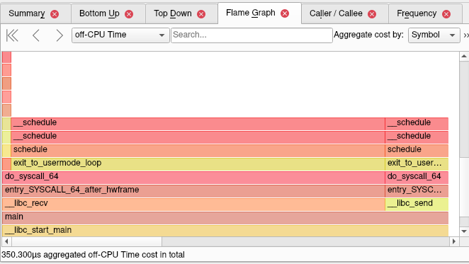
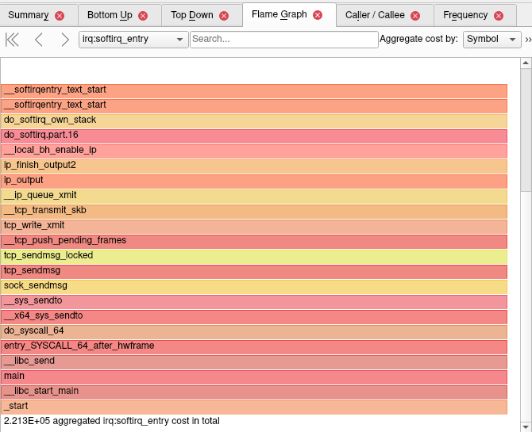

[](https://github.com/Radrik5/softirq/actions/workflows/cmake-multi-platform.yml)

# Linux Soft IRQ Load Generator

This project generates CPU utilization caused by Soft IRQ on Linux through a C++ client-server application that generates intensive network traffic using non-blocking sockets and busy polling.

The project is crated to replicate issue described in https://github.com/KDAB/hotspot/issues/717

## Project Goal

The application consists of:

* **Client**: Connects to the server and generates network load.
* **Server**: Accepts connections and processes data.

The objective is to generate high CPU usage in the Soft IRQ subsystem by sending and receiving small TCP messages rapidly.

## Code Structure

The project consists of the following main files:

- client.cpp: Client application that connects to the server and generates network load
- server.cpp: Server application that accepts connections and processes data
- config.h: Common configuration parameters shared between client and server
- CMakeLists.txt: Build configuration for the project

## Building the Project

### Prerequisites

* CMake (3.10 or higher)
* C++ compiler supporting C++11

### Build Steps

```bash
mkdir -p build
cd build
cmake -DCMAKE_BUILD_TYPE=RelWithDebInfo ..
cmake --build .
```

The executables `client` and `server` will be located in the `build` directory.

## Running the Application

### Simple Run

Start the server first, then run the client:

```bash
# Terminal 1
./bin/server

# Terminal 2
./bin/client [optional_duration_in_seconds]
```

Default duration is 5 seconds if not specified.

### Binding Processes to Specific CPUs

Using `taskset` helps isolate processes to specific CPU cores, allowing for clearer observation of how Soft IRQ processing affects CPU usage. User and system CPU time will typically be less than 100%, with the remaining time accounted for by Soft IRQ processing.

````bash
# Terminal 1, bind server to CPU 0
taskset -c 0 ./bin/server

# Terminal 2, bind client to CPU 2 (assuming hyper-threading)
taskset -c 2 ./bin/client [optional_duration_in_seconds]
````

### Monitoring Soft IRQ Usage

To monitor Soft IRQ CPU usage:

```bash
sudo yum install sysstat

mpstat -P 0,2 1
```

Example output when nothing is running:

```txt
10:43:45     CPU    %usr   %nice    %sys %iowait    %irq   %soft  %steal  %guest  %gnice   %idle
10:43:46       0    1.00    0.00    0.00    0.00    0.00    0.00    0.00    0.00    0.00   99.00
10:43:46       2    1.00    0.00    0.00    0.00    0.00    0.00    0.00    0.00    0.00   99.00
```

Example output when server is running (0 %idle due to busy polling):

```txt
10:44:46     CPU    %usr   %nice    %sys %iowait    %irq   %soft  %steal  %guest  %gnice   %idle
10:44:47       0   26.00    0.00   74.00    0.00    0.00    0.00    0.00    0.00    0.00    0.00
10:44:47       2    0.00    0.00    0.00    0.00    0.00    0.00    0.00    0.00    0.00  100.00
```

Example output when server and client are running:

```txt
10:46:52     CPU    %usr   %nice    %sys %iowait    %irq   %soft  %steal  %guest  %gnice   %idle
10:46:53       0   18.18    0.00   70.71    0.00    0.00   11.11    0.00    0.00    0.00    0.00
10:46:53       2   16.00    0.00   69.00    0.00    0.00   15.00    0.00    0.00    0.00    0.00
```

Example output of `ps` when server and client are running:
```txt
$ ps u | grep '\(server\|client\)'
dmitry   87992 87.7  0.0  13880  1912 pts/2    R+   10:51   0:12 ./bin/server
dmitry   87993 85.5  0.0  13864  1900 pts/4    R+   10:51   0:09 ./bin/client 30
```

### Profiling with perf record and Hotspot

To collect performance data for standard off-CPU time analysis, run:

```bash
sudo perf record \
    -e cycles \
    -e sched:sched_switch --switch-events \
    --sample-cpu \
    -m 1G \
    --aio -z \
    --call-graph dwarf \
    ./bin/client 1
```

Hotspot with collected data shows almost no off-CPU time:



To collect softirq events, run:

```bash
sudo perf record \
    -F 1000 \
    -e cycles \
    -e sched:sched_switch --switch-events \
    -e irq:softirq_entry \
    -e irq:softirq_exit \
    --sample-cpu \
    -m 1G \
    --aio -z \
    --call-graph dwarf \
    ./bin/client 1
```

Note that `-F 1000` affects `sched:sched_switch` sampling and therefore probably affects off-CPU time in Hotspot but without `-F 1000` the amount of recorded softirq events is enormous.

Soft IRQ events in Hotspot:


